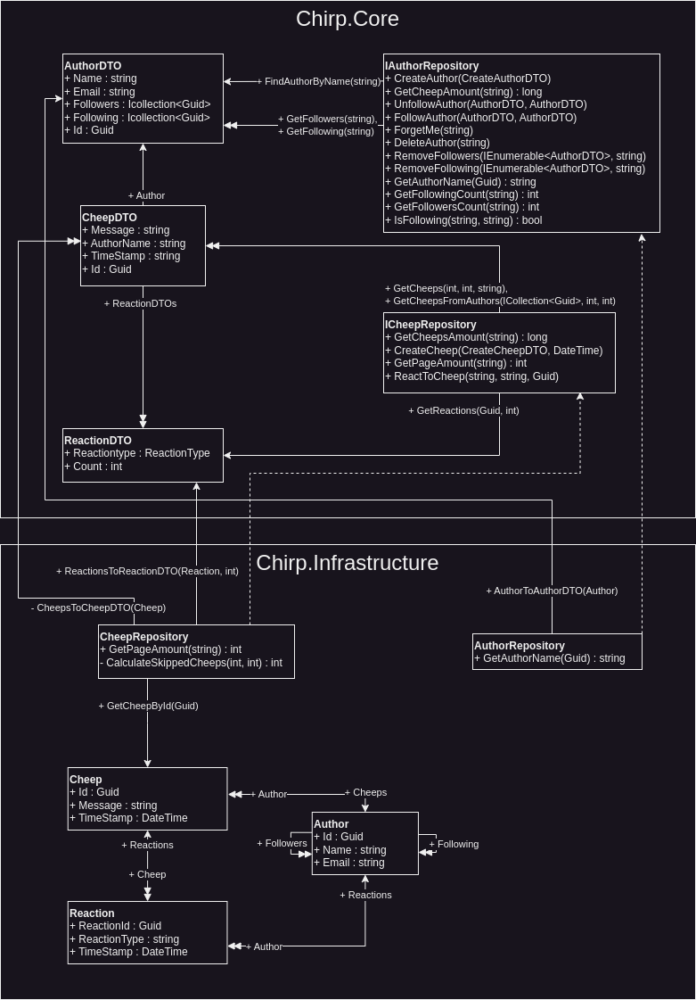
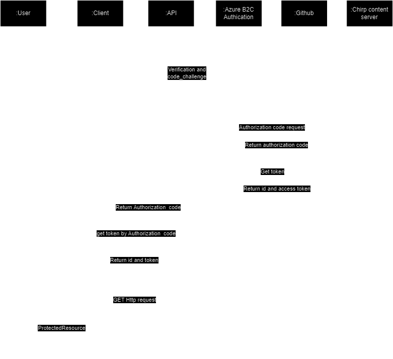

\newpage

# Table of Contents

\tableofcontents

\newpage

<!--
Introduction???
-->

# 1. Introduction

In this report we will briefly describe the project work and outcome of our chat-application Cheep.

# 2. Design and Architecture of Chirp!

## Domain model



<!--
Write about what we want to represent (Cheeps, Authors, etc.)
Maybe incorporate functionality of a normal social media app?
-->

## Architecture — In the small

<!--
Show image from slides of onion architecture
-->


Our chirp application is implemented with an "onion skin architecture". This means that our program is divided into three layers, core, infrastructure and web. The three layers follow a hierarchical structure where core < infrastructure < web. In this comparison, only greater layers may use or know the contents of the lower layers. Following this structure should result in reusable and loosely coupled code. In a company setting, code from "core" could be reused in many different applications and contexts around the entire company.

## Architecture of deployed application

<!--
Write about how we used the onion skin architecture, and specifically what functionality we put in what layer (eg. DTO's in core)
-->

## User activities

<!--
Should we write about what a user can do in our application here? User flow?
-->

## Sequence of functionality/calls through Chirp!



# 3. Process

## Build, test, release, and deployment

We aimed to introduce singlefile releases, but prioritized new features and other requirements, delaying its implementation. The infrequent releases resulted from both postponing until singlefile capability and a lack of defined milestones for stable functionality. Insufficient release planning, and constant development on important features contributed to this pattern. Since different features were almost always under development, we rarely felt our program was in a stable, shippable state.

Back when we were developing Chirp.CLI, we had a more solid release schedule. This is because it was the primary distribution of the software. When the project transitioned into a Razor application, the primary distribution became our Azure Web App, and our releases became way less frequent. Releases of our Razor application would also be quite difficult to use (since it requires docker), and would lack all online functionality. So for an ordinary user there would be absolutely no reason to run our code from releases.

BLABLA automatic deployment from main

## Teamwork

<!--
Show a screenshot of your project board right before hand-in. Briefly describe which tasks are still unresolved, i.e., which features are missing from your applications or which functionality is incomplete.
-->

<!--
Briefly describe and illustrate the flow of activities that happen from the new creation of an issue (task description), over development, etc. until a feature is finally merged into the main branch of your repository.
-->

BLABLA When creating a new issue, we consider...
Once an issues is created, it is automatically added to the "Unassigned" column on our Project Board. If we have a good idea of who should make it, we assign people, and move it to the "Todo" column. If we want to delay an issue for when we have better time, we move it to the "Less important" column. Once we start working on an issue, we assign ourselves (if not already), and move it to "In progress".
When we work on a feature, we are usually one or two people. Sometimes we use pair programming. Other times one will work on the frontend, while the other works on the backend. Once we believe a feature is ready for main, we make a pull request, and ask a group member who hasn't been a part of this issue, to review it. Depending on the complexity of the code, we ask one or more people to review it. Sometimes we explain the code to the reviewer(s). Sometimes we find that some of the code could be better, or maybe that some of the changes were unnecessary or too intrusive, and should be reverted. Depending on how big of an issue it is, and how much time we have, we either write a comment, and possibly an issue about fixing it, and then approve the pull request, or we write a comment, and request changes, before allowing for a push to main.

<!-- OVERVEJER OM DET HER BØR VÆRE MED: Sometimes, we work on multiple issues on the same branch, because some of our other issues are currently incompatible, and we delay merge of one branch until another is merged. This makes some of our pull requests quite big, and sometimes incomprehensible. We strive to make our pull requests as compact and focused as possible. -->

## How to make Chirp! work locally

Prerequisites: Microsoft .Net 7.0 and Docker

To make Chirp! work locally, first you must clone the repository:

```
git clone https://github.com/ITU-BDSA23-GROUP23/Chirp.git
```

From here, you must first start a MSSQL docker container using the following command:

```
sudo docker run -e "ACCEPT_EULA=Y" -e "MSSQL_SA_PASSWORD=DhE883cb" \
   -p 1433:1433 --name sql1 --hostname sql1 \
   -d \
   mcr.microsoft.com/mssql/server:2022-latest
```

On windows or osx, make sure that the docker desktop application is running first.
On linux systems, ensure the Docker daemon is running. It can be started with:

```
sudo dockerd
```

Next, from the root directory in /Chirp, run the following command:

```
dotnet run --project src/Chirp.Web
```

Alternatively, from the /Chirp.Web folder:

```
dotnet run
```

Finally, open your browser of choice and connect to `https://localhost:7040`

## How to run the test suite locally

To run the test suites locally, first you will have to start your docker container.

MAC:

```
docker run -e "ACCEPT_EULA=Y" -e "MSSQL_SA_PASSWORD=DhE883cb" -p 1433:1433 --name sql1 --hostname sql1 -d mcr.microsoft.com/azure-sql-edge
```

Windows:

Linux/wsl:

Next, open up a terminal in the project. Assuming you are in the root of the repository Chirp, direct to either:

```bash
cd Test/Chirp.Razor.Tests
```

or

```bash
cd Test/UITest/PlaywrightTests
```

In both the Chirp.Razor.Tests and PlaywrightTests folder, to run the tests:

```bash
dotnet test
```

The project contains two test suites, Chirp.Razor.Tests and UITest.
The first test suite contains unit tests, integration tests and end-to-end tests. **\*\***Har vi det?
The unit tests are testing the functionality of the isolated components in our application, that is testing methods within our application of core, infrastructure and web components. <!-- Tror ikke vi har unit tests af web components. -->
The integration tests are testing the interactions of different components in our application, that is testing when using logic from e.g. the infrastructure layer in our web components.
The end-to-end tests...?

The second test suite contains our UI tests. These are UI automation tests, using Playwright to simulate a users interactions with the user interface. These are implemented such that we can ensure that the UI behaves as expected, performing actions and receiving expected output, when doing all types of interactions with our application from the UI.

<!-- The Playwright tests are responsible for testing our razorpage functionality, as we don't have unit tests for the methods in the .cs files for the pages. -->

# 4. Ethics

## License

License: WTFPL

## LLMs, ChatGPT, CoPilot, and others

The LLMs used for this project during developments are ChatGPT and GitHub CoPilot. ChatGPT has been used carefully, mainly for asking questions about the code or errors in the code. It has also been used for generating small pieces of code, mainly in the cshtml files. Likewise, CoPilot has been used for generating some of the code in cshtml, but has also been used for helping with code, partly making some of the methods in the repositories and creating outlines for tests.
Generally, the responses of the LLMs has been helpful for better understandment of the code and speeding up the development. It has not really created code that we would not have done ourselves, but it has provided some logic in the methods, which has been helpful in terms of taking inspiration for futher method extensions.
The application of LLMs has sped up the development process. Especially, CoPilot has made coding much faster, as it for most parts provides the code needed, e.g., if we already made a test for a method FollowAuthor, in no time CoPilot can make the same one for UnfollowAuthor. However, there has indeed been a few times, when ChatGPT or CoPilot does not understand the requests as intended, and therefore not providing useful outputs. But, for most of the time, they have been helpful tools for development.

```

```
