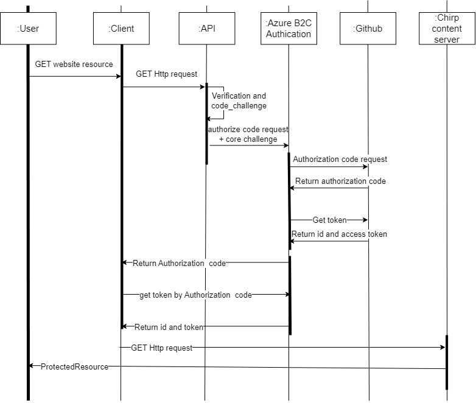

\newpage

# Table of Contents

\tableofcontents

\newpage

<!--
Introduction???
-->

# 1. Introduction

In this report we will briefly describe the project work and outcome of our social media application, Chirp. The project is developed for the course "Analysis, Design and Software Architecture (Autumn 2023)", taught by Helge Pfeiffer and Rasmus Lystrøm, at the IT University of Copenhagen.

# 2. Design and Architecture of Chirp!

## Domain model

<!-- Det er muligt at dette diagram bør være med i architecture - In the small, og at vores domain model kun bør være hvordan de foreksllige database elementer er relateret. -->


\newpage

<!--
Write about what we want to represent (Cheeps, Authors, etc.)
Maybe incorporate functionality of a normal social media app?
-->

In our program, the user posts messages in the form of a cheep. the Cheep class is a model representing what a cheep is. A cheep consists of an id, Author, message, TimeStamp, and a list of Reactions

The author class represents a user of our application. it contains all the information the program needs to model a user.

The reaction class is used to keep track of the different reactions a user can append to a cheep. It contains the reaction type, the author, and the cheep that has been reacted to.

We have repositories for author and cheep. These repositories contain methods to manipulate and retrieve data in/from the database.

We use Data transfer objects (DTOs) to send and receive data between the different layers of our program. The DTOs contain the same information as the classes, but they are not used as entity classes for the model. So they are a safe way to make sure the user can't change the database in an unwanted way.

## Architecture — In the small

<!--
Show image from slides of onion architecture
-->

<!--
Write about how we used the onion skin architecture, and specifically what functionality we put in what layer (eg. DTO's in core)
-->

{width=50%}

Our chirp application is implemented with an "onion skin architecture". This means that our program is divided into three layers, core, infrastructure, and web. The three layers follow a hierarchical structure where core < infrastructure < web. In this comparison, greater layers may use and know the contents of the layers below. Lower layers cannot know about nor use anything from the above layers. Following this structure should result in reusable and loosely coupled code.

In a company setting, code from "core" could be reused in many different applications and contexts around the entire company. In our project, core only contains DTO's and interfaces that are used throughout our entire project. Chirp.Infrastructure contains all our domain implementations. This means that our repositories, domain classes (Cheep, Author, Reaction) are located here. Both our database migrations and our database-context (dbContext) are additionally located in the infrastructure. Chirp.Web contains all our frontend code, in the shape of cshtml files, and their corresponding cshtml.cs code. Chirp.Web is the main executable c# project, which means that the Program.cs file is located here. Additionally, a database initialization script is also located here, which can populate and initiate our database with data provided by the course.

## Architecture of deployed application


Our application is a web application hosted by Azure. Clients use our web application through HTTP calls. Our application sends and receives data from and to our Azure SQL server database. If a user tries to access a page that requires authentication, they are redirected to authentication using B2C. Authentication is done through their GitHub account. afterward, they are redirected back to our page. If already authenticated, a cookie is saved and they can skip the login process.

## User activities

<!-- Har sandsynligvis skrevet for meget her, måske alt for meget, men havde lige lidt overskud, så fyrede det hele af.
- Har rettet din tekst igennem - Edward -->

The navigation bar is shown on all pages and is used to redirect the user to other pages.

**Not authenticated:**

{width=80%}

When accessing our web page, users are presented with the public timeline, which displays cheeps. On this page, users can navigate between pages to view older or newer cheeps
The navigation bar consists of links to "Public Timeline" and "login".
Users have the option to click on the author's name within cheeps, redirecting them to the author's private timeline, and showing cheeps made by that author.
The top bar contains a login button, which when clicked facilitates authentication through B2C, using a user's GitHub account.
If already logged in to GitHub on their browser, they are directed to the Public Timeline. If not, they must login with a GitHub account.

**Authenticated:**

{width=80%}

The navigation bar is changed upon user authentication. It has links to the pages: "My Timeline", "Public Timeline", "For You", "About Me" and "Logout." The navigation bar is visible on all pages.
On every page where there are cheeps, the user is able to express reactions, and follow/unfollow authors of all cheeps, not made by themself.
On the public timeline, they are also able to submit cheeps and sign out. They can also react to cheeps and follow/unfollow authors on cheeps if they aren't the author of the cheep themselves.
On "my timeline", the user can submit cheeps, and see their own cheeps.
On "For you", they can see the cheeps of the people that they follow.
On the "About me" page, they can see the users they follow, the people who follow them, the number of each, and their own most recent cheeps. They can press the "Forget me" button, which deletes everything about them, from the database. They can also go to the timeline of other users by pressing their name found on any of the lists.

<!--
Should we write about what a user can do in our application here? User flow?
-->

## Sequence of functionality/calls through Chirp!

When a user accesses the website they make a http GET request. If they make such a request to a page to which they are not authorized, then the program makes an authorized code request + code challenge to Azure AD B2C attempting to Authenticate the user. Azure B2C then sends an authorization code request to Github, Where the user can authorize with GitHub to login. If the user is successful with this, then it returns an authorization code to B2C and B2C get a token from github with the code. B2C then returns an authorization code to the Client. The client can get authorization id and token from B2C. When the user has logged in and is granted authorization to the page, then the server returns the web page and the client can render it.



# 3. Process

## Build, test, release, and deployment

### Merge to the main workflow

During our project development process, our main method of building, testing, and deploying was with two automated workflows. The structure of which is described by the diagram below:


In the diagram, you can see our two main workflows, the "deploy to Azure" workflow (filename main_bdsagroup23chirprazor.yml) and the build and test workflow (filename dotnet.yml). Github CodeQL is also included in the diagram as it is an automated process, that runs whenever we merge into main. The "deploy to Azure" workflow is auto-generated by Azure and slightly modified. It publishes our application and uploads it to our Azure web application. This was our preferred method of automated deployment. Our build and test workflow builds our project, and runs our tests (not including ui tests). The two workflows and CodeQL run in parallel. This means that our web app would be deployed even if our test suite failed. This was practical in our case, for rapid development, since our tests in many cases were not updated to work with our newer code. This meant that we could test our code on the live server without updating all our tests first. Not testing before deploying also meant that the deployment process was quicker. Going around our tests suite would in a real-world scenario, with an active application, result in huge stability issues.

For "automatic releases" we used a separate workflow (filename publish.yml). The process of which can be seen in the diagram below:


The functionality of this workflow is to build, test and package our application automatically, whenever a release is created.

We aimed to introduce single-file releases, but prioritized new features and other requirements, delaying its implementation. The infrequent releases resulted from both postponing until single-file capability, and a lack of defined milestones for stable functionality. Insufficient release planning, and constant development on important features contributed to this pattern. Since different features were almost always under development, we rarely felt our program was in a stable, shippable state.

Back when we were developing Chirp.CLI, we had a more solid release schedule. This is because it was the primary distribution of the software. When the project transitioned into a Razor application, the primary distribution became our Azure Web App, and our releases became way less frequent. Releases of our Razor application would also be quite difficult to use (since it requires docker), and would lack all online functionality. So for an ordinary user, there would be absolutely no reason to run our code from releases.

## Teamwork

<!--
Show a screenshot of your project board right before hand-in. Briefly describe which tasks are still unresolved, i.e., which features are missing from your applications or which functionality is incomplete.
-->

<!--
Briefly describe and illustrate the flow of activities that happen from the new creation of an issue (task description), over development, etc. until a feature is finally merged into the main branch of your repository.
-->


### Unresolved issues

- Releases currently don't publish our code as single file
- Released compiled code currently does not work
- The features 'Pagination' and 'Forget me' could be more user friendly. We have a few issues for that.
- Delete data about users from B2C.
- Automate use of docker for local use and testing
- Migrate to .net 8
- Feedback on failed cheep submit
- Check for nullable properties


For this project, we did most of our work while sitting together in a meeting, either physically or on a Discord server. Then we would split of into smaller groups, but still be available for other team members.

On Github, we have used a centralized workflow with protection on the main branch and a requirement for pull requests to make changes.

When creating a new issue, we focus on the functional requirements and make sure to create an issue that covers these. Sometimes, we already do the design process here, and we describe in the issue more precisely how to reach the functional requirements. Other times we let the people working on the issue make all design decisions. For large issues or very important design decisions, we often discuss it in the group, even with team members who aren't assigned to the issue.

<!-- Once an issues is created, it is automatically added to the "Unassigned" column on our Project Board. If we have a good idea of who should make it, we assign people, and move it to the "Todo" column. If we want to delay an issue for when we have better time, we move it to the "Less important" column. Once we start working on an issue, we assign ourselves (if not already), and move it to "In progress". -->

When we work on a feature, we are usually one or two people. Sometimes we use pair programming. Other times one will work on the front-end while the other works on the back-end. Once we believe a feature is ready for main, we make a pull request and ask a group member who hasn't been a part of this issue to review it. Depending on the complexity of the code, we ask one or more people to review it. Sometimes we explain the code to the reviewer(s). Sometimes we find that some of the code could be better, or maybe that some of the changes were unnecessary or too intrusive and should be reverted. Depending on how big of an issue it is and how much time we have, we either write a comment, and possibly an issue about fixing it, and then approve the pull request or we write a comment requesting changes before allowing for a push to main.

<!-- OVERVEJER OM DET HER BØR VÆRE MED: Sometimes, we work on multiple issues on the same branch, because some of our other issues are currently incompatible, and we delay merge of one branch until another is merged. This makes some of our pull requests quite big, and sometimes incomprehensible. We strive to make our pull requests as compact and focused as possible. -->

## How to make Chirp! work locally

Prerequisites: Microsoft .Net 7.0 and Docker

To make Chirp! work locally, first you must clone the repository:

```
git clone https://github.com/ITU-BDSA23-GROUP23/Chirp.git
```

On windows or osx, make sure that the docker desktop application is running first.
On linux systems, ensure the Docker daemon is running. It can be started with:

```
sudo dockerd
```

From here, you must first start an MSSQL docker container using the following command:

```
sudo docker run -e "ACCEPT_EULA=Y" -e "MSSQL_SA_PASSWORD=DhE883cb" \
   -p 1433:1433 --name sql1 --hostname sql1 \
   -d \
   mcr.microsoft.com/mssql/server:2022-latest
```

Next, from the root directory in /Chirp, run the following command:

```
dotnet run --project src/Chirp.Web
```

Alternatively, from the /Chirp.Web folder:

```
dotnet run
```

Finally, open your browser of choice and connect to `https://localhost:7040`

## How to run the test suite locally

To run the test suites locally, first you will have to start your docker container.

MAC:

```
docker run -e "ACCEPT_EULA=Y" -e "MSSQL_SA_PASSWORD=DhE883cb" -p 1433:1433 --name sql1 --hostname sql1 -d mcr.microsoft.com/azure-sql-edge
```

Windows:
Open Docker desktop and run the `mcr.microsoft.com/mssql/server:2022-latest` image

Linux/wsl:

```
sudo docker run -e "ACCEPT_EULA=Y" -e "MSSQL_SA_PASSWORD=DhE883cb" \
   -p 1433:1433 --name sql1 --hostname sql1 \
   -d \
   mcr.microsoft.com/mssql/server:2022-latest
```

Next, open up a terminal in the project. Assuming you are in the root of the repository Chirp, direct to either:

```bash
cd Test/Chirp.Razor.Tests
```

or

```bash
cd Test/UITest/PlaywrightTests
```

In both the Chirp.Razor.Tests and PlaywrightTests folder, to run the tests:

```bash
dotnet test
```

The project contains two test suites, Chirp.Razor.Tests and UITest.
The first test suite contains unit tests and integration tests.
The unit tests are testing the functionality of the isolated components in our application, that is testing methods within our application of core, infrastructure and web components. <!-- Tror ikke vi har unit tests af web components. -->
The integration tests are testing the interactions of different components in our application, that is testing when using logic from e.g. the infrastructure layer in our web components.

The second test suite contains our UI tests. These are UI automation tests, using Playwright to simulate a users interactions with the user interface. These are implemented such that we can ensure that the UI behaves as expected, performing actions and receiving expected output, when doing all types of interactions with our application from the UI. Before being able to run the test the program has to be running on the same local machine.

<!-- The Playwright tests are responsible for testing our razorpage functionality, as we don't have unit tests for the methods in the .cs files for the pages. -->

# 4. Ethics

## License

License: WTFPL

## LLMs, ChatGPT, CoPilot, and others

The LLMs used for this project during development are ChatGPT and GitHub CoPilot. ChatGPT has been used carefully, mainly for asking questions about the code or errors in the code. It has also been used for generating small pieces of code, mainly in the cshtml files. Likewise, CoPilot has been used for generating some of the code in cshtml, but has also been used for helping with code, partly making some of the methods in the repositories and creating outlines for tests.
Generally, the responses of the LLMs have been helpful for better understanding of the code and speeding up the development. It has not really created code that we would not have done ourselves, but it has provided some logic in the methods, which has been helpful in terms of taking inspiration for further method extensions.
The application of LLMs has sped up the development process. Especially, CoPilot has made coding much faster, as it for most parts provides the code needed, e.g., if we already made a test for a method FollowAuthor, in no time CoPilot can make the same one for UnfollowAuthor. However, there have indeed been a few times, when ChatGPT or CoPilot did not understand the requests as intended, and therefore not provide useful outputs. But, for most of the time, they have been helpful tools for development.

```

```
